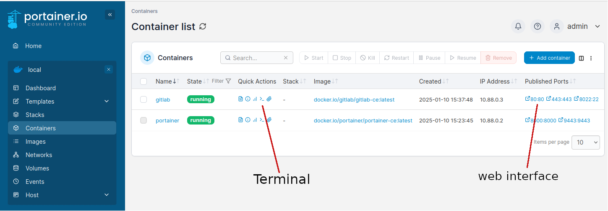

[BACK](./Install_LXC.md)

---

# Setup Gitlab

I am going to use podman to download and install the gitlab server.

```
sudo apt update
sudo apt install podman podman-compose
sudo nano /etc/containers/registries.conf
```

Add Docker Hub to the list of registries. Look for the [registries.search] section and add `docker.io` to the list:

```
[registries.search]
registries = ['docker.io', 'quay.io', 'registry.fedoraproject.org', 'registry.access.redhat.com', 'registry.centos.org']
```

## Install Portainer-CE (reccomended) 

Unless you are already familiar with docker / portainer, it is strongly reccomended you use the community issue of portainer (a FOSS alternative to docker).

Now to help us manage the containers, install `portainer-ce` as follows:

```
podman pull docker.io/portainer/portainer-ce`
```

Create volumes for the portainer container:

```
sudo podman volume create portainer_data
```

Run portainer:

```
sudo podman run -d -p 8000:8000 -p 9443:9443 --name portainer --restart=always --privileged -v /run/podman/podman.sock:/var/run/docker.sock -v portainer_data:/data portainer/portainer-ce
```

From a machine on your network, open portainer CE in browser:

```
firefox https://192.168.1.2:9443
```

## Install Gitlab

Now we can install gitlab to listen on our private ip address

First, pull down the latest image:

```
sudo podman pull gitlab/gitlab-ce:latest
```
 It's big, so maybe make a coffee. Once downloaded, we can run it by running each of these lines:

 ```
export GITLAB_HOME=/opt/gitlab
export TSIP=192.168.1.2
sudo mkdir -p $GITLAB_HOME
sudo mkdir -p $GITLAB_HOME/data $GITLAB_HOME/config $GITLAB_HOME/logs
sudo podman run --detach \
    --hostname $TSIP \
    --publish $TSIP:443:443 \
    --publish $TSIP:80:80 \
    --publish $TSIP:8022:22 \
    --name gitlab \
    --restart always \
    --volume $GITLAB_HOME/config:/etc/gitlab \
    --volume $GITLAB_HOME/logs:/var/log/gitlab \
    --volume $GITLAB_HOME/data:/var/opt/gitlab \
    gitlab/gitlab-ce:latest
 ```

It will take a few minutes to start up. Once started, you can access via a browser. A useful way to do this is via portainer:



The user is root. Using the container terminal (suggest using portainer)  the password is found in /etc/gitlab/initial_root_password


